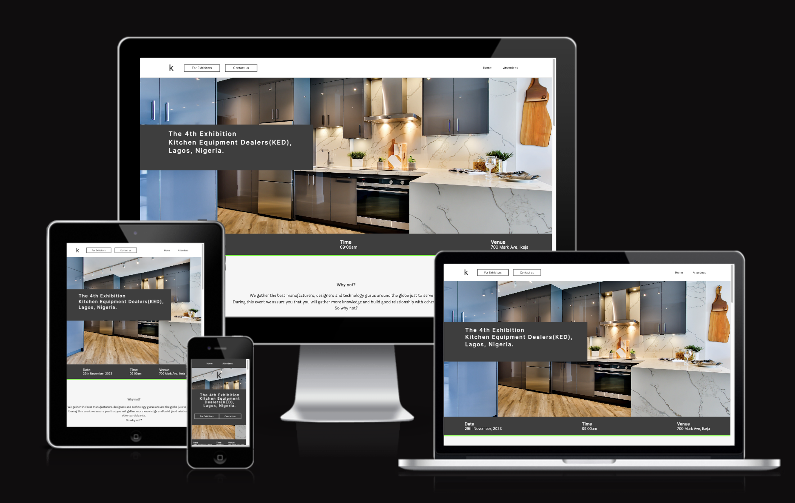

# Kitchen Equipments Exhibition

This website is a project that is built with love to provide its users easy access to registration, information and updates about the upcoming exhibition. Companies, technical experts and individuals can have the opportunity to start good business relationships, exhibit inovative technologies as well as share experiences and knowledge in the world of kitchen equipments and utensils.

## [You can view the website live here on GitHub page](https://chikadim.github.io/kitchen-equipments-exhibition/)

## Table of Content

- [UX](#ux)
    - [User goals](#user-goals)
    - [User stories](#user-stories)
    - [Structure of the website](#structure-of-the-website)
    - [Wireframes](#wireframes)
    - [Mockup](#mockup)
- [Features](#features)
- [Testing](#testing)
    - [Functionality testing](#functionality-testing)
    - [Compatibility testing](#compatibility-testing)
    - [Code Validation](#code-validation)
    - [User stories testing](#user-stories-testing)
    - [Issues found durring site development](#issues-found-durring-site-development)
    - [Performance testing](#performance-testing)
- [Deployment](#deployment)
- [Credits](#credits)
- [Screenshots](#screenshots)

## UX

### User goals

- __Website owner goals__
  - We built this website to provide the users an easy way to register for the exhibition.
  - It is a user-first project that brings latest information and technology about kitchen equipment and utensils to them.
  - During the exhibition the registered user would get to meet business minded people, tech experts, Architects and Engineers.

- __User goals__
  - The user gets accurate information about date, venue and time of the exhibition.
  - Using the website would also provide the user a means to secure a spot in such a huge event
  - This opens the door for countless business opportunities and relationships to the user. 

### User stories

- __User stories as a business owner__
  - I would like to register on the website as an exhibitor to showcase our product to the world.
  - I am hoping to build business relationships with other Companies who manufacture and supply Kitchen equipments. 
  - My expertise and knowledge in this field will be offered to our old and new customers to make good decisions when dealing with Kitchen Equipments.

- __User stories as a designer__
  - I would like to register on the website as a visitor to acquire ideas and knowledge about latest innovations in the industry.
  - It will not be a bad idea to give out technical advise to manufacturers of this equipments to improve the standard of their products.
  - After registering on this website, i would like to make it known to my clients so that they can register too and have plenty of choices while making purchases for their Kitchen.

### Structure of the website

This website is structured to be user-friendly, easy to navigate and remanins well positioned on all sizes of devices. The overall performance of the website is fantastic and smooth. There are beautiful transitions between different parts of the website wether on mobile or desktop or tablet.

### Wireframes

Wireframes sketch and brainstorming

I used figma to create the wireframes of the website.

### Mockup

- __Colors__
  Main colors use in the project are as follows:
  - background color: #ffffff
  - font color: #000000
  - hover color: #48ff00
  - primary color: #3e3e3e
  - complementary color: #1e1e1e

  __Fonts__
  As main fonts i used Inter and Laila. Then i used sans-serif as alternative.
 

- __Images__
  - I used images from [unsplash.com](www.unsplash.com) and i credited them in the [credits](#credits) section.

[Back to table of content](#table-of-content)

___
## Features

This website consists of 4 pages. They are accessible from navigation menu and also from the footer.

### Existing Features
- __Home page__
  - The navigation bar
    * The navigation bar is featured in all four pages and is fully responsive. It includes links to Logo, For exhibitors, Contact us, Home page and Attendees page. This helps the user to navigate easily to pages that are of interest to them.
    

  - The Date, Venue and Time section
    * This brief section quickly present the most important information to a user. The Date, Venue and Time for the exhibition.
    

  - Expected Attendees section
    * This section contains list of portfolios of the expected exhibitors and expected visitors. There are two images complementing the both lists. The user will immediately get familiarized with the professionals that are expected to attend the exhibition.
    
  
  - Sponsors section
    * In this section, a user can find just a few of our top sponsors. This is likely to boost the confidence of the user who is attending.
    

  - The footer section
    * Here, a user can find the menu for easy navigation. Also there is the Host social media handles which a user can also connect to for more information and socialize.
    

- __For exhibitors page__
  - Exhibitors read up section
    * This contains three different topic concerning Kitchen. The topics are just to keep the user in the mood and hopeful of a wonderful exhibition experience.
    

  - Send a message form
    * Through this form a user can reach us to make enquiry or offer suggestions. It helps the user to submit her concerns if any.
    

- __Contact us page__
  - Customer service section
    * On this page a user can make an immediate conatact by calling or texting some of our customer service staff who are available 24/7.
  - Enquiry form
    * Through this form a user can reach us to make enquiry or offer suggestions.
    

- __Attendees page__
  - Attendees list
    * On this page a user can make an immediate conatact by calling or texting some of our customer service staff who are available 24/7.
  - Enquiry form
    * Through this form a user can reach us to make enquiry or offer suggestions.
    

    ## Testing

    ### Functionality testing
    I used google chrome and mozilla for testing the responsiveness of the site throughout development stage.

  

